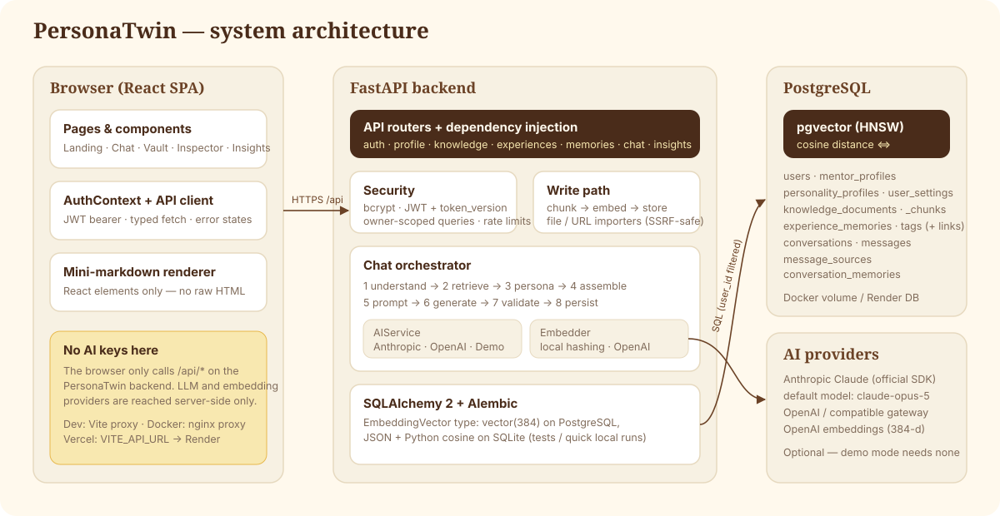
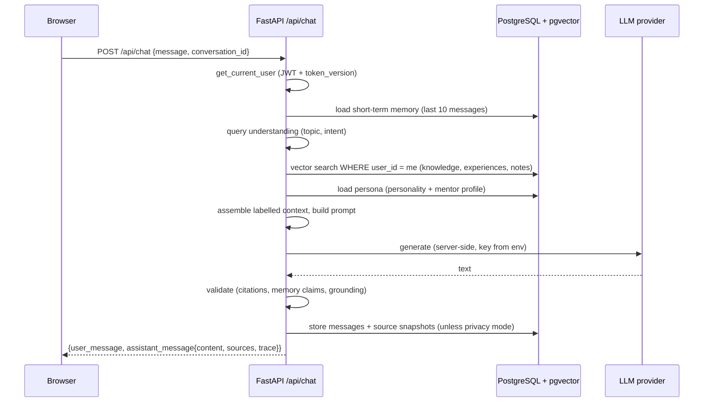

# Architecture

PersonaTwin is a three-tier application: a React single-page app, a FastAPI service, and PostgreSQL with pgvector.

## Components

| Layer | Responsibility | Key files |
| --- | --- | --- |
| **Frontend** | Pages, design system, auth state, typed API client. Never contacts an AI provider. | `frontend/src/services/api.ts`, `frontend/src/context/AuthContext.tsx`, `frontend/src/pages/**` |
| **API layer** | Routing, request validation, dependency injection of the DB session and current user | `backend/app/api/deps.py`, `backend/app/api/routes/*` |
| **Services** | Business logic: chat pipeline, retrieval, indexing, embeddings, AI providers, importers, insights | `backend/app/services/*` |
| **Persistence** | SQLAlchemy 2 models, Alembic migrations, dialect-aware vector type | `backend/app/models/*`, `backend/app/db/*`, `backend/alembic/*` |

## Request lifecycle (chat)

## Design principles

1. **Memories come from the database, not the model.** The LLM receives retrieved rows as labelled data and must cite them.
2. **Ownership everywhere.** Every query on private data filters by `user_id`; chunks carry a denormalised `user_id` so
   vector search can filter without a join.
3. **Same code on two databases.** `app/db/types.py::EmbeddingVector` is `vector(384)` on PostgreSQL and JSON text on SQLite.
   Retrieval uses SQL `<=>` on PostgreSQL and an equivalent Python cosine on SQLite.
4. **Graceful degradation.** No AI key → demo composer. Provider outage → demo composer + visible notice. Embedding outage →
   memory saved without a vector, reported as "not indexed" in Memory health, fixable with Re-index. Database error → `503`
   with a friendly message.
5. **Transparency.** Every reply carries its sources (with relevance and whether they were cited) and a step-by-step trace.

## Frontend structure

- `components/ui` — Button, Card, Field (Input/Textarea/Select/Slider/Toggle), Modal/ConfirmDialog, TagInput, Feedback
  (Badge, Avatar, StatCard, EmptyState, LoadingState, ErrorState, Skeleton, ProgressRing, PageHeader). Toasts live in
  `context/ToastContext.tsx`.
- `components/chat` — `ChatMessage`, `ChatInput`, `TypingIndicator`, and a safe mini-markdown `RichText` renderer.
- `components/memory` — `KnowledgeCard`, `KnowledgeForm`, `ExperienceCard`, `ExperienceForm`, `MemoryCard`, `MentorProfileCard`.
- `components/persona` — option cards, sliders, values and philosophy editors shared by Onboarding and Personality.
- `components/illustrations` + `config/visuals.ts` — original SVG artwork, referenced only through the registry.
- `hooks/useAsync.ts` — loading/error/reload state for every data fetch, plus `useDebounce` and `useDocumentTitle`.

Routes are lazy-loaded; `RequireAuth` redirects anonymous users to `/login` and un-onboarded users to `/onboarding`.
