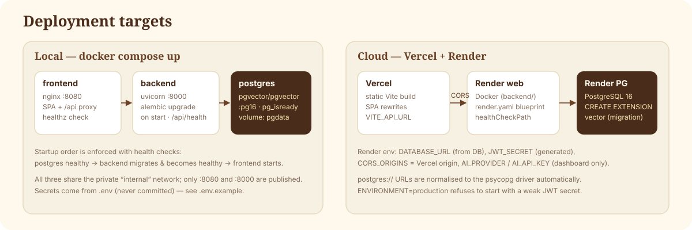

# Deployment



## Local with Docker Compose

```bash
cp .env.example .env          # set JWT_SECRET; optionally AI_PROVIDER + AI_API_KEY
docker compose up --build
```

- Frontend: http://localhost:8080 (nginx serves the SPA and proxies `/api` to the backend)
- API docs: http://localhost:8000/api/docs
- PostgreSQL: `pgvector/pgvector:pg16`, data in the `pgdata` volume

The backend entrypoint runs `alembic upgrade head` before starting uvicorn; the first migration enables the `vector`
extension and creates HNSW indexes. Health checks gate start-up: postgres → backend → frontend.

Reset everything: `docker compose down -v`.

## Backend on Render

1. Push the repository to GitHub.
2. In Render choose **New → Blueprint** and select the repo. `render.yaml` creates:
   - `personatwin-db` — managed PostgreSQL 16
   - `personatwin-api` — Docker web service from `backend/`, health check `/api/health`
3. Set the secret env vars in the Render dashboard:
   - `AI_API_KEY` — your Anthropic key (or switch `AI_PROVIDER` to `openai` / `demo`)
   - `CORS_ORIGINS` — your Vercel URL, e.g. `https://personatwin.vercel.app`
   - `JWT_SECRET` is generated automatically; `DATABASE_URL` is wired from the database.
4. Deploy. The migration runs on every start (it is idempotent).

Notes
- Render's `postgres://…` connection string is normalised to `postgresql+psycopg://…` by the app.
- The migration runs `CREATE EXTENSION IF NOT EXISTS vector`; Render PostgreSQL supports pgvector. On a provider where the
  database user can't create extensions, enable `vector` once as an admin.
- Free instances sleep when idle; the first request after a pause is slow.

## Frontend on Vercel

1. **New Project** → import the repo → **Root directory: `frontend`** (framework preset: Vite).
2. Environment variable: `VITE_API_URL=https://<your-render-service>.onrender.com` (no trailing slash).
3. Deploy. `vercel.json` adds SPA rewrites and security headers.
4. Make sure the Vercel origin is listed in the backend's `CORS_ORIGINS`.

`VITE_API_URL` is a public URL, not a secret — no AI keys are ever given to the frontend.

## Running without Docker

See the README's *Local setup*. SQLite (`DATABASE_URL=sqlite:///./personatwin.db`) is fine for trying the app; vector search
then runs in Python. Use PostgreSQL + pgvector for anything real.

## Production checklist

- [ ] `ENVIRONMENT=production` and a strong `JWT_SECRET` (the app refuses to start otherwise)
- [ ] `CORS_ORIGINS` limited to your frontend origin(s)
- [ ] `AI_PROVIDER` / `AI_API_KEY` set in the host's secret store, not in git
- [ ] Consider `EMBEDDING_PROVIDER=openai` for better semantic recall (then re-index from Settings)
- [ ] Database backups enabled on your provider
- [ ] For more than one backend instance, replace the in-process rate limiter with a shared store
